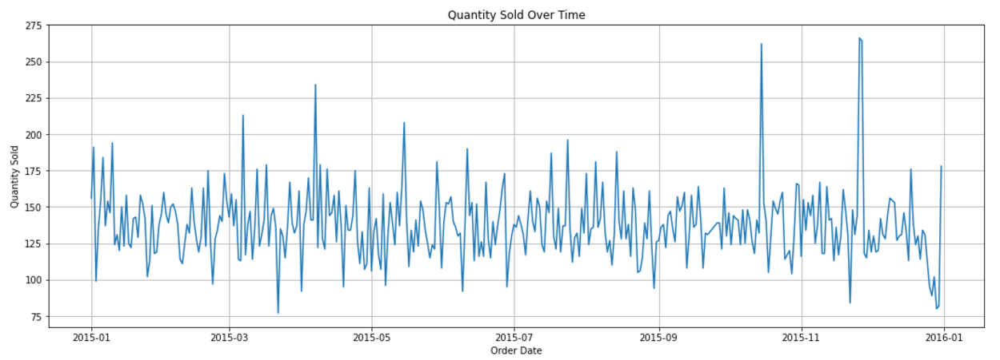
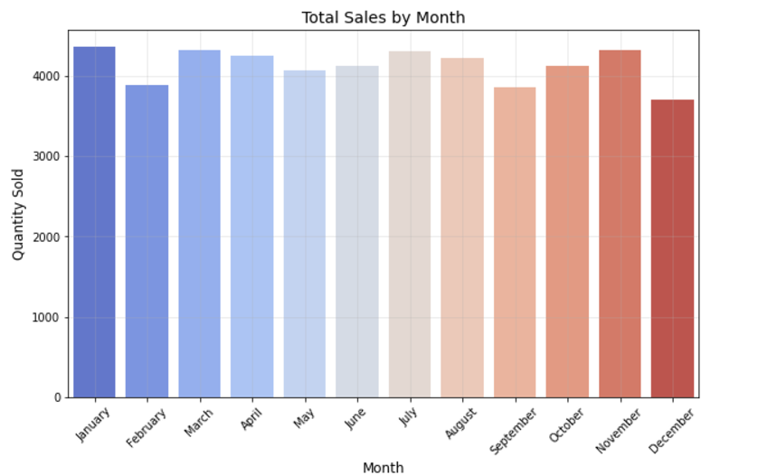
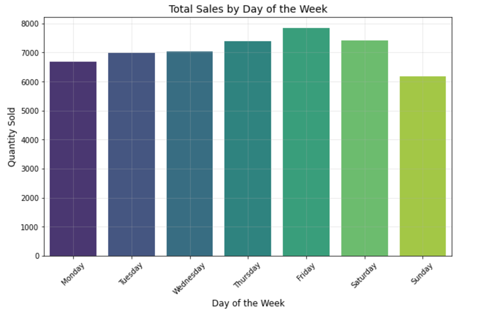
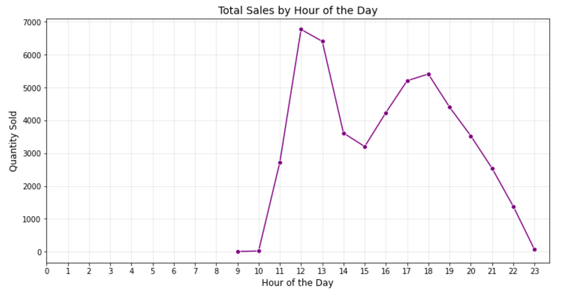
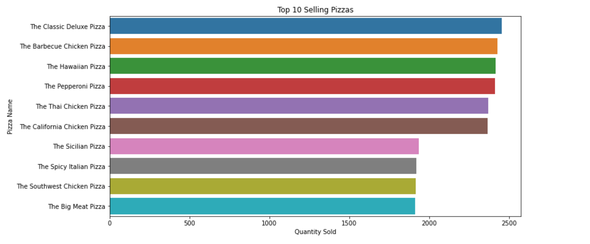
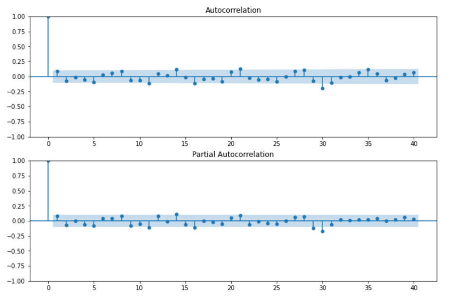
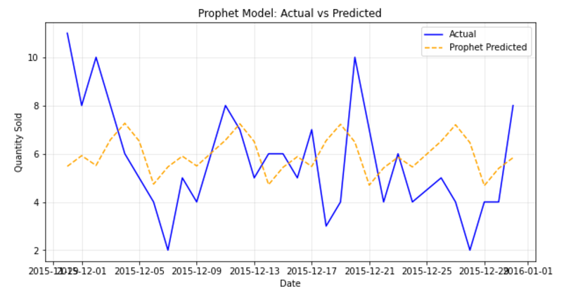
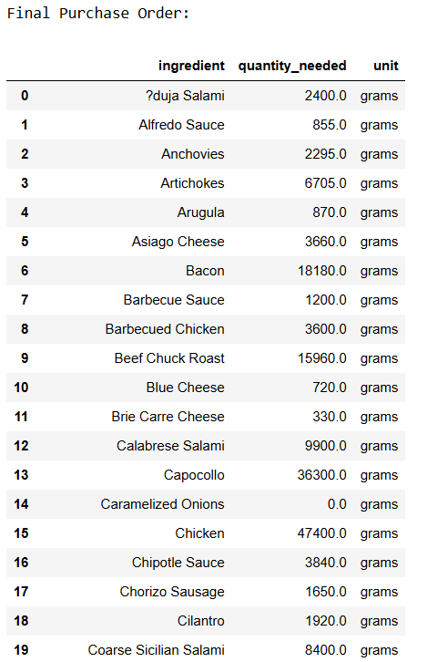

# Domino's - Predictive Purchase Order System

## Project Overview
Domino's aims to enhance its inventory management process by predicting future pizza sales and creating automated purchase orders for ingredients. This system helps ensure optimal ingredient stock levels, reducing waste, preventing stockouts, and improving overall supply chain efficiency.  

## Key Features
- Accurate **Sales Forecasting** for the next week using advanced predictive models.
- Automated **Ingredient Calculation** and generation of a **Purchase Order** based on sales predictions.
- Comprehensive **Exploratory Data Analysis (EDA)** to identify key trends and patterns in sales data.
- **Evaluation Metrics** to measure and validate the accuracy of the prediction models.

---

## Skills Takeaway
- **Data Cleaning and Preprocessing**: Handling missing values, outliers, and inconsistencies.
- **EDA**: Discovering insights from historical sales data.
- **Time Series Forecasting**: Utilizing models like ARIMA, SARIMA, Prophet, and LSTM.
- **Predictive Modeling**: Building accurate sales prediction systems.
- **Business Decision-Making**: Creating actionable insights for inventory and supply chain management.
- **Real-World Application**: Applying data science to solve industry-specific challenges.

---

## Dataset
1. **Sales Data**: Historical records including date, pizza type, size, quantity sold, and revenue details.
2. **Ingredient Data**: A dataset listing the ingredients required for each pizza type, along with their respective quantities.

### Dataset Sources:
- [Pizza Sales Dataset](https://github.com/pavankethavath/Dominos---Predictive-Purchase-Order-System/blob/main/Pizza_Sale%20-%20pizza_sales.csv)
- [Pizza Ingredients Dataset](https://github.com/pavankethavath/Dominos---Predictive-Purchase-Order-System/blob/main/Pizza_ingredients%20-%20Pizza_ingredients.csv)

---
## Domain
**Food Service Industry**
--
## Business Use Cases
1. **Inventory Management**: Maintaining the right stock levels for ingredients.
2. **Cost Optimization**: Reducing waste by avoiding over-purchasing.
3. **Sales Prediction**: Informing promotional strategies with accurate demand forecasting.
4. **Supply Chain Efficiency**: Streamlining the ordering process to avoid disruptions.

---

## Project Workflow

### 1. Data Preprocessing
- **Handled missing values**, inconsistent formats, and outliers.
- **Transformed time-related data** to capture trends and seasonality effectively.

### 2. Exploratory Data Analysis (EDA)
- **Visualized trends and patterns** such as top-selling pizzas, sales by day of the week/month, and peak hours.
- Identified seasonality and variability in sales data.
 





 






### 3. Model Development and Comparison
Implemented and compared four forecasting models:
- **ARIMA**: Showed a flat trend, underperforming in variability capture.
-   
- **SARIMA**: Better seasonality capture, but lagged during sudden demand changes.
- **Prophet**: Best model with the lowest MAPE, effectively handling trends and seasonality.
  
- **LSTM**: Neural network approach struggled with variability but remains promising for larger datasets.

### 4. Forecasting Sales
- Using Prophet, forecasted daily pizza sales for 91 pizza types over a 7-day period.

### 5. Ingredient Calculation
- Calculated required quantities for each ingredient using the forecasted sales and ingredient dataset.
- Generated a **Purchase Order** summarizing ingredient requirements.
  
---

## Results
- **Best Model**: Prophet with a MAPE of **0.43**.
- **Forecast Output**: Predicted daily pizza demand for the next 7 days.
- **Purchase Order**: A detailed breakdown of ingredient quantities required for the forecast period.

---

## Technologies Used
- **Languages & Libraries**: Python, Pandas, NumPy, Matplotlib, Seaborn, Statsmodels, TensorFlow, Prophet.
- **Models**: ARIMA, SARIMA, Prophet, LSTM.
- **Metrics**: MAPE (Mean Absolute Percentage Error).

---

## How to Run the Project

1. **Clone the Repository**:
   ```bash
   git clone https://github.com/your-repository/dominos-predictive-order-system.git


## Key Insights
- Seasonality: Clear weekly and monthly trends were observed, aiding precise predictions.
- Prophet's Superiority: Best suited for time series with seasonality and trend variations.
- Real-World Application: Forecasting enhances Domino's operational efficiency, minimizing costs and waste.
